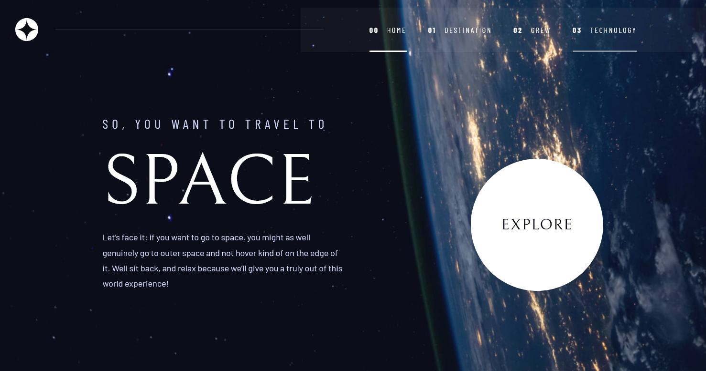

# Frontend Mentor - Space tourism website solution

This is a solution to the [Space tourism website challenge on Frontend Mentor](https://www.frontendmentor.io/challenges/space-tourism-multipage-website-gRWj1URZ3). Frontend Mentor challenges help you improve your coding skills by building realistic projects.

## Table of contents

- [Overview](#overview)
  - [The challenge](#the-challenge)
  - [Screenshot](#screenshot)
  - [Links](#links)
- [My process](#my-process)
  - [Built with](#built-with)
  - [What I learned](#what-i-learned)
  - [Useful resources](#useful-resources)
- [Author](#author)
- [Acknowledgments](#acknowledgments)

## Overview

### The challenge

Users should be able to:

- View the optimal layout for each of the website's pages depending on their device's screen size
- See hover states for all interactive elements on the page
- View each page and be able to toggle between the tabs to see new information

### Screenshot

### Links

- Live Site URL: [Add live site URL here](https://phillipp2.github.io/space-tourism)

## My process

### Built with

- Semantic HTML5 markup
- CSS custom properties
- Flexbox
- CSS Grid
- Javascript

### What I learned

I built this project while referencing Srimba's tutorial (https://scrimba.com/learn/spacetravel).

In particular, I learned how to use ARIA attributes to improve user accessibility, how to overlap HTML elements to create compelx layouts with css grid, and how to support responsive images using the picture element.

My biggest takeaway from this project is learning to build a css design system that promotes reusable code.

## Author

- Frontend Mentor - [@PhillipP2](https://www.frontendmentor.io/profile/PhillipP2)

## Acknowledgments

Thank you Frontendmentor, Srimba, and Kevin Powell for making this challenge freely available and providing resources to guide students through this project.
